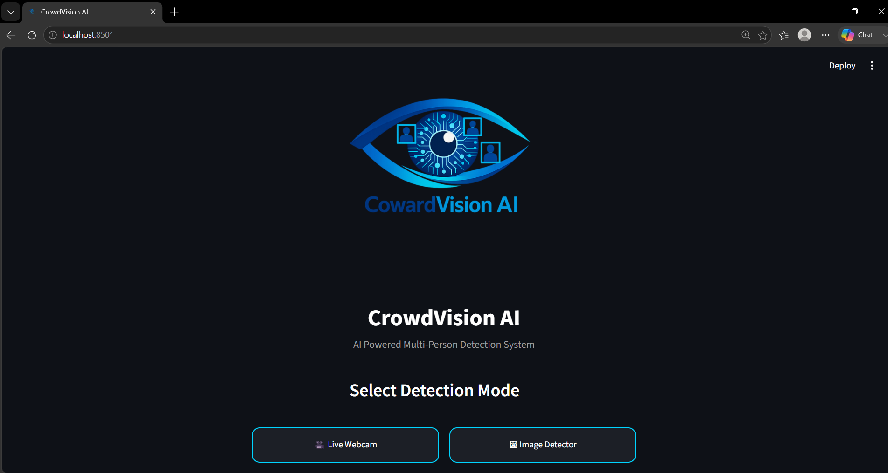
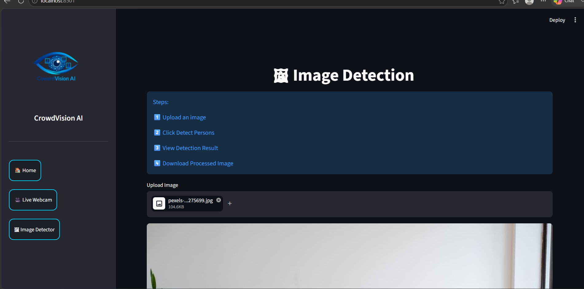
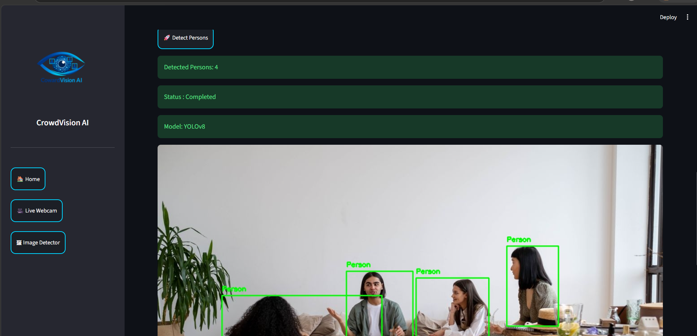
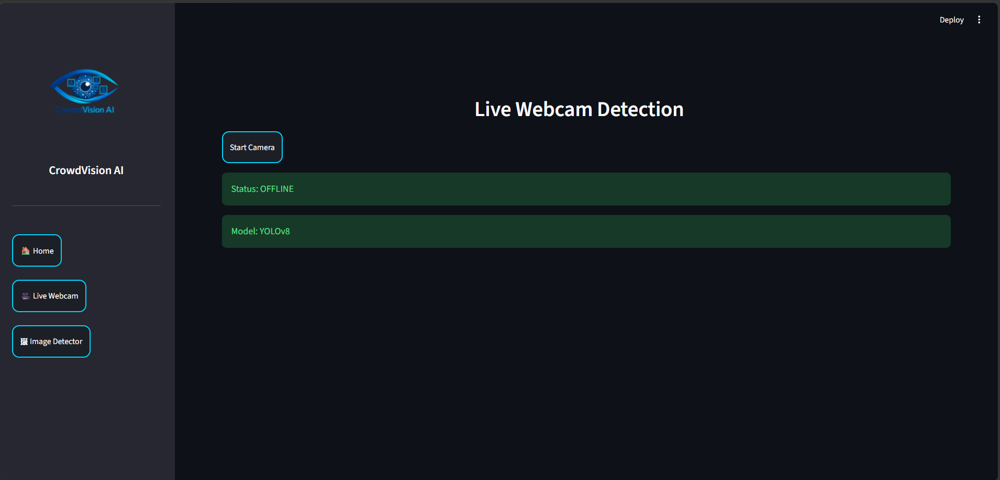

# CrowdVision AI

### AI-Powered Multi-Person Detection and Counting System

CrowdVision AI is a real-time computer vision application that leverages YOLOv8, OpenCV, Streamlit, and WebRTC to accurately detect, track, and count multiple people in uploaded images and live webcam streams.

Designed for crowd monitoring and intelligent surveillance applications, the system provides instant person detection, live analytics, and an interactive web-based dashboard for seamless user experience.



---

## 🚀 Live Demo

**Try the application here:**

https://crowdvision-ai-multi-person-detection-and-counting-system-5sfb.streamlit.app

---

## 📌 Key Features

* 🎯 Real-Time Multi-Person Detection using YOLOv8
* 👥 Accurate Person Counting
* 📷 Image Upload Detection
* 🎥 Live Webcam Detection via WebRTC
* 📊 Live Detection Statistics
* 💾 Download Detection Results
* ⚡ Fast and Efficient Inference
* 🌐 Fully Interactive Streamlit Dashboard
* 🎨 Modern and User-Friendly Interface
* ☁️ Cloud-Deployed Application

---

## 📖 Project Overview

CrowdVision AI utilizes the YOLOv8 object detection framework to identify and localize people within images and live video streams.

The application supports two primary modes:

### 🖼 Image Detection Mode

Users can upload an image, perform person detection, view the total count, and download the processed output image.

### 🎥 Live Webcam Detection Mode

Users can access their device camera directly through the browser and perform real-time person detection using WebRTC technology.

The system is designed to demonstrate practical applications of Artificial Intelligence and Computer Vision in crowd monitoring and smart surveillance environments.

---

## 🖼 Application Screenshots

### Home Page


### Image Detection



### Detection Result



### Live Webcam Detection



---

### 🛠 Built With

🔹 **Python** – Core programming language used for application development.

🔹 **YOLOv8 (Ultralytics)** – Deep learning model used for real-time person detection.

🔹 **OpenCV** – Image processing and computer vision operations.

🔹 **Streamlit** – Interactive web application framework.

🔹 **WebRTC** – Browser-based live webcam streaming.

🔹 **NumPy** – Efficient numerical computations and array operations.

🔹 **Pillow (PIL)** – Image loading and manipulation.

---

## 📂 Project Structure

```text
CrowdVision-AI/
│
├── app.py
├── detector.py
├── requirements.txt
├── README.md
│
├── assets/
│   ├── app_icon.png
│   ├── home_page.png
│   ├── image_detection.png
│   ├── image_detection_result.png
│   └── webcam_detection.png
│
├── utils/
│   └── helpers.py
│
└── __pycache__/
```

---

## ⚙ Installation

### Clone Repository

```bash
git clone https://github.com/bantucharuhaasini-cmd/CrowdVision-AI-Multi-Person-Detection-and-Counting-System.git
```

### Navigate to Project Directory

```bash
cd CrowdVision-AI-Multi-Person-Detection-and-Counting-System
```

### Install Dependencies

```bash
pip install -r requirements.txt
```

### Run Application

```bash
streamlit run app.py
```

---

## 🎯 Applications

* Smart Surveillance Systems
* Crowd Monitoring and Management
* Event Attendance Analysis
* Public Space Monitoring
* Smart City Infrastructure
* Building Occupancy Tracking
* Security and Safety Analytics
* Educational Computer Vision Demonstrations

---

## 📈 Performance Highlights

* Real-Time Person Detection
* Accurate Crowd Counting
* Lightweight User Interface
* Browser-Based Webcam Access
* Fast YOLOv8 Inference
* Cloud Deployment Ready

---

## 🔮 Future Enhancements

* Crowd Density Estimation
* Heatmap Visualization
* Video File Analysis
* Person Tracking with Unique IDs
* Entry/Exit Monitoring
* Occupancy Analytics Dashboard
* Alert System for Overcrowding
* Multi-Camera Support

---

## ⭐ Acknowledgements

* Ultralytics YOLOv8
* OpenCV Community
* Streamlit
* WebRTC
* Python Open-Source Ecosystem

---

## Note

This project is developed for educational, research, and learning purposes.

---

## 👨‍💻 Author

**Charu Haasini Bantu**

B.Tech – Computer Science & Engineering (Artificial Intelligence & Data Science)

